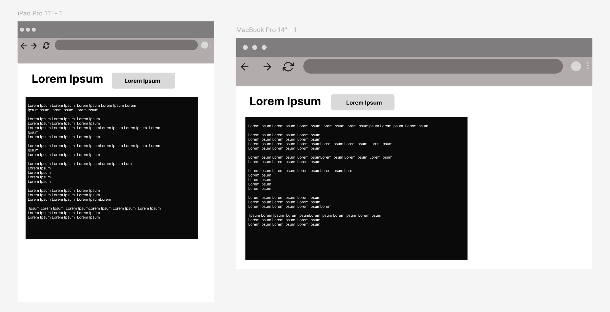

# Standup Updates App

<p align="center">
  
</p>

[Link to Website](https://standup-updates-app-5910da38655e.herokuapp.com/)

[GitHub Repo](https://github.com/Alumsdesigns/standup-updates-app)

[View Stanup Updates Sucessfully sent to my Google Sheets](https://docs.google.com/spreadsheets/d/1_PDKyq4haiQ9ivY9sxae0GMc9Cknm5I2PIneLN4jfqc/edit?gid=1680754323#gid=1680754323). Data within is for the purposes of the MVP and therefore fictitious.


***


## About

The standup Update App is a simple terminal tool that helps you keep track of what you’re working on each day. Instead of relying on sticky notes, random emails, or trying to remember everything right before a stand-up, the app gives you one clean place to jot down your updates. It keeps things structured and easy to review, so you always know what you did yesterday, what you’re doing today, and what might be blocking you.


***


## Table of Contents

- [User Experience Research and Design](#user-experience-research-and-design)
  - [Core Objectives for the App](#core-objectives-for-the-app)
  - [Scope](#scope)
  - [Skeleton](#skeleton)

- [Features](#features)
  - [Current Features](#current-features)
  - [Future Features](#future-features)
- [Data Model](#data-model)
- [Application Overall Workflow](#application-overall-workflow)
- [Manual Testing](#manual-testing)
  - [Code Testing](#code-testing)
  - [Accessibility](#accessibility)
  - [Performance](#performance)
  - [Bugs](#bugs)
- [Deployment](#deployment)
  - [How to Clone the Repository](#how-to-clone-the-repository)
  - [Create Data Model and Integrate Using an API](#create-data-model-and-integrate-using-an-api)
  - [Deploy with Heroku](#deploy-with-heroku)
- [Python Library Dependencies and Packages](#python-library-dependencies-and-packages)
- [Software & Web Applications](#software--web-applications)
- [How to Create the Heroku app](#how-to-create-the-heroku-app)
- [Constraints](#constraints)
- [Local Development Option: “Exit locally”](#local-development-option-exit-locally)
- [Credit](#credit)


***


## User Experience Research and Design


### Method

Professionals, especially software engineers and managers, need a simple and reliable way to record their daily work. The process should be quick, structured, and easy to review — taking no more time than scribbling notes on paper or recalling updates in a meeting.


A successful solution should minimise the effort required for software engineers and professionals to capture their updates, providing a fast, no-frills way to record daily progress. Furthermore, by keeping entries in a single, structured log, users can easily review past work, prepare for stand-ups, and share accurate updates with their teams.

Making a switch to a digital logging system is a game-changer for how you manage your work. Now, you can have all your work details right at your fingertips, which makes it super easy to see how far you've come. This is a huge help when it's time to get ready for a performance review or share updates with your team. Plus, you can quickly fix or add to any of your notes right there in the log. That way, you don't have to worry about digging through old, messy notes or trying to remember everything—your info is always correct and ready to go.


#### Leading User Stories


* As a Software Engineer... 
    * I want a simple way to record and strack my daily standup updates for me and my manager.

    * I want to have an app that lets me add entries, edit them, read them and delete them before they are pushed to a designated google sheets.

    * I want a simple, easy-to-use interface so people can use the app without any help.

    * I want to limit how long each entry can be so the data stays clean and consistent.

    * I want the app to restart cleanly so it doesn't run into performance issues.

    * I want to format the Google Sheet with styles so the data looks clean and is easy to read.

   * I want the app to handle connection issues without crashing so the user experience is smooth.

* As the Engineering Manager... 
    * I want the log to save automatically to Google Sheets so I can track team progress easily.

    * I want to identify users by name so I can review their work for performance talks.

    * I want the sheet to be neat and organized with clear headers so I can quickly understand what's happening.

    * I want the log to use UTC time so there's no confusion with different time zones.


#### Core Objectives for the App


* The Standup Update App provides a straightforward way for professionals to capture and manage their daily work updates for their Standup in a formatted structure and as a method to keep for end of year reviews or refelctions on work done. It is also a way for their managers to keep track of work done and stay ontop of updates. 

* It is designed to be quick and intuitive, taking no more effort than jotting down a note before a stand-up, while ensuring entries are structured and easy to review later.

* By replacing scattered notes, emails, and last-minute memory with a single, organised log, the app reduces stress, saves time, and improves the accuracy of team communication and reporting.


### Scope

An agile approach of keeping the in scope features simple and aligned to the strategy for the MVP will be adopted.
Below is a list of the leading features for the application.


#### In Scope Features

* Daily Log Captures a simple way to record your updates under Yesterday, Today, Blockers, and FYI (For Your Information).

* Edit as You Go  Add, tweak, or delete individual lines instead of retyping everything.

* Saves Your Work, Logs are stored locally and also pushed into Google Sheets so they’re easy to find later.

* Clear instructions, menus, and error messages so it’s easy to use.

* Smart Dates, Automatically figures out “Yesterday” based on weekends and Irish bank holidays.

* Works Anywhere, deployable on Heroku/Cloud, so you can run it without worrying about local setup.

* Allows you to create enteries, read entries, update/edit entries and delete entires before saving to google sheets.


#### Out of Scope Features (for a future release)

* Multiple Users, No accounts or logins yet — this version is just for individuals.

* Slack or Teams Integration, It won’t automatically post your updates into chat apps (maybe later).

* No charts or dashboards, just clean text logs for now.

* No auto-summarising or suggestions yet — everything is written by you.

* Web or Mobile App, It’s terminal-only for now.

* Advanced Security, Beyond Google Sheets’ built-in protections, there’s no role-based access or extra encryption. 


## Application Design Considerations

The App will follow a clear, structured interaction flow designed to support professionals in recording and managing their daily work updates efficiently.

* On launch, the user is greeted with a welcome message in the CLI (Command Line Interface).

* The user provides their name, which serves as a reference for their daily log entry.

* The app then guides the user through each structured section: Yesterday, Today, Blockers, and FYI.

* Within each section, the user has full control: they can add new entries, edit existing entries, or delete items as needed.

* Once all sections are completed, the system generates a consolidated overview of the log for review.

* At this stage, the user can either, Save the log, Return to edit specific sections, or Exit without saving.

* Saved logs are automatically stored locally and synchronised with Google Sheets for long-term tracking and accessibility.

* Upon successful completion, the user is shown a confirmation message, along with guidance on copying logs into Google Sheets or sharing them with their team.

The structure of the application may evolve during development to incorporate user feedback and usability improvements.


## Skeleton

Standup Updates app is designed to be quick and intuitive, so updating your notes should take about the same time as jotting them down manually—making sure nothing gets lost or overlooked.

The interface is clean and simple, with a clear header showing your name and the date, helping you focus on what matters: capturing your updates. Colors and formatting are used subtly to guide your attention without overwhelming the page.

If you make a mistake while entering a line, helpful prompts will guide you to fix it, and you can always go back to the main menu or restart the log without losing your work. There’s also a “Restart Log” option so you can start fresh whenever needed.

The overall goal is to make keeping your daily log easy, efficient, and even a little enjoyable—so it fits smoothly into your day.


## Flowchart

A flowchart of the developers journey has been created in  [Lucidchart](https://www.lucidchart.com). The final version of the application may evolve slightly as development continues and we incorporate feedback from users.


<p align="center">
    
</p>


## Wireframe

During this phase, a wireframe from the app interface was developed, using [Figma](https://balsamiq.com/wireframes/) (see image below - the wireframe is located within the project [Repo](https://github.com/Alumsdesigns).


<p align="center">
    
</p>

## Colour 

<p align="center">
    
</p>
<p align="center">
    
</p>
<p align="center">
    
</p>


The color palette has been chosen to create a clear, organized, and visually appealing interface for the Standup Updates App. Accent colors help draw attention to important sections, while the main background and text colors ensure readability. Brighter tones are used sparingly so that key information stands out without overwhelming the user. Soft background colors also provide a calm and professional feel, making it easy to focus on entering and reviewing updates. Google sheet colours are soft pastels to bring some fun to it.


### Font
#### Terminal Font

Arial is a clean and highly readable system font. As a default font, it's a reliable choice for the app's text-based interface, ensuring clarity and accessibility across different devices and operating systems.

#### Google Font for google sheets
Roboto is a Google font that provides a modern, professional aesthetic. It complements Arial by giving the app a more polished and contemporary feel, enhancing the overall user experience without sacrificing legibility.


<p align="center">
    
</p


***

## Features

### Current Features

* A welcome message greets the user
<p align="center">
    
</p

***

* As the process starts, the user is asked for their name.
<p align="center">
    
</p>

* The user is prompted to choose an action via the keyboard, for yestrdays activities. when the add line has been selected the user can now type and press enter and select save once completed. 
<p align="center">
    
</p>

* User is prompted again to choose an action. They can add to today's activities and save.
<p align="center">
    
</p>

* User is prompted again to choose an action. They can add a line for any blockers they have experienced.
<p align="center">
    
</p>

* User is prompted again to choose an action. They can add a line for FYI  additional information outside of their project or relavent.
<p align="center">
    
</p>

* The user can select to edit their previous log
<p align="center">
    
</p>

* User can replave the previouse log.
<p align="center">
    
</p>

* User can choose to delete their entry or cancel the deletion
<p align="center">
    
</p>

* If user pressed enter and does not select a command an error will pop up telling the user the issue. 
<p align="center">
    
</p>

* A table will apper of all entrys from Yeaterday,Today,Blockers and FYI, the user will then be prompted to either to save or make amendments.
<p align="center">
    
</p>

* User selects save a prompt instruction will pop up to inform the user to wait and no futher action is required.
<p align="center">
    
</p>

* User can then head over to google sheets where logs are saved.
<p align="center">
    
</p>
***


### Future Features

Following a successful MVP launch, the Standup Update App can be further developed over a short period to improve usability and user experience.

* Smartphone support – make the app responsive and easy to use on mobile devices.

* Web features – add an About page, Contact info, and helpful resources for new users.

* Export options – allows users to download or share their log via google sheets options PDF.

* Notifications – send reminders or confirmations via email/SMS when a log is saved.


## Data-Model 

Data Model
The application's data is structured around the DailyLog class and its internal self.sections dictionary. This dictionary acts as the in-memory data model, temporarily storing all updates a user enters.

This data model is designed for simplicity and clarity:

It organises entries into four key lists "Yesterday," "Today," "Blockers," and "FYI."

All user input is collected, validated, and held within this structure before being written to an external Google Sheet.

The Google Sheet itself serves as the external data store, providing a persistent, shareable record of all entries. The app translates the in-memory data model into the sheet's tabular format for long-term storage and easy review by a team


## Application overall workflow

* The Standup update application is structured around dedicated functions that guide the user through each step of collecting, validating, and returning updates. These functions are orchestrated within the main workflow, ensuring that every entry is checked and confirmed with the user before being saved.

* All updates are stored in an external Google Sheet, providing a clear, shareable, and easily maintainable record. This sheet also enables team leads to review logs across the group with minimal effort. For the user experience, the application leverages the Rich library to display logs in well-formatted tables, ensuring each entry is presented with clarity and readability throughout the logging process.

The Google Sheet can be viewed online at [Standup_Updates_2025](https://docs.google.com/spreadsheets/d/1_PDKyq4haiQ9ivY9sxae0GMc9Cknm5I2PIneLN4jfqc/edit?gid=1680754323#gid=1680754323).

***


## Manual Testing 

Throughout the development of the Standup Updates, tools such as PEP8 Online were used to ensure the Python code is clean, maintainable, and adheres to best practices. Interactive functionality and terminal usability were tested to make sure the application is intuitive, user-friendly, and accessible. These tools, along with additional testing methods, were also applied during the testing phase to validate reliability and correct integration with Google Sheets. Full details and testing results can be found in the project repository.

The following sections summarise the tests and results.


### Code Testing

The code on each file has been tested to ensure clean, maintainable code, using the appropriate validation service, W3C Markup for HTML, and PEP8 Online for Python.

Below are the summarised results from these tests:
- Tools used
W3C HTML Validator:
W3C HTML Validator Testing Used to check the structural integrity and validity of the HTML markup.
W3C CSS Validator: W3C CSS Validator Testing Employed to validate CSS syntax and ensure compliance with web standards.

* **run.py** - 0 Errors / 0 Warnings
* **layout.html** - 0 Errors / 0 Warnings
* **index.html** - 1 Errors / 2 Warnings; relating to the absence of boiler plate ```<!DOCTYPE HTML>``` code which is anticipated given the structure of the app.
***

### Accessibility 

 The homepage has been tested using the [Wave (Web Accessibility Evaluation Tool)](https://wave.webaim.org/) with zero alerts and only 1 contrast error where the Footer text was triggering a low-contrast error. As a result, I increased the size of the text and separated over two lines to improve readability for users with low-vision. 

***

### Performance 

The standup Updates has been evaluated for performance and accessibility on desktop. The terminal interface responds smoothly to keyboard input, with fast updates and interactive prompts via questionary. To further enhance accessibility, the contrast between terminal text and background could be improved for better readability. Additionally, minor optimizations in input handling and table rendering via rich could further improve responsiveness and user experience.

Test occurred using Lighthouse within Chrome Dev Tools on 17/09/2025 with the following results:

<p align="center">
    
</p>


***

### Bugs

The issues listed  below we identified and fixed in september 2025.

- Run program button - Low contrast between text and the background is an accessibility issue where the difference in color and brightness is not great enough for the text to be easily read. solution was to ensure a high enough contrast ratio. The WCAG 2.1 standard recommends a minimum contrast ratio of: 4.5:1 for normal text. 3.0:1 for large text (18pt or 14pt bold).

- HTML Header h2  - Replacing h2 with h1. This structure allows screen readers to provide a "table of contents" to users, letting them jump directly to the section they're interested in - wave flagged this and I fixed it

- As I went I fixed PEP8 errors such as Line too long and traling white space. This makes the code easier to read, especially when viewed on different screen sizes or when multiple files are open side-by-side.

- Attribute error fix and time error with utc timezone fixed

- Called main() instead restart system as can cause security issue

- All fixes can be seen as i used fix in conventional commit messages


## Deployment

This project was deployed using the steps below with version releasing active. Please do not make any changes to files within this repository as any changes pushed to the main branch will be automatically reflected on the live website. Instead, please follow the steps below which guide you to forking the website where changes can be made without impact to the live website. Thanks!


### How to clone the repository

- Go to the - [Standup updates](https://github.com/Alumsdesigns/standup-updates-app).
on gitgub
- Click the "Code" button to the right of the screen, click HTTPs and copy the link there
- Open a GitBash terminal and navigate to the directory where you want your cloned folder to live
- On the command line, type "git clone " then paste in the copied url and press the "Enter" key to begin the clone process


### Create data model and integrate using an API

<details>
    <summary></summary>

Create a Spreadsheet (Data Model)
1. Login to your Google account, create an account if necessary
2. Navigate to Sheets, Googles version of Microsoft Excel
3. Start a new spreadsheet, amend the title at the top i.e., standup updates
4. Create 1 Sheets/Tabs, titling 'standup_updates_2025'
5. Logs will automaticaly be saved here.

Setup API
1. Navigate to [Google Cloud Platform](https://cloud.google.com/gcp?utm_source=google&utm_medium=cpc&utm_campaign=emea-gb-all-en-bkws-all-all-trial-e-gcp-1011340&utm_content=text-ad-none-any-DEV_c-CRE_500227884420-ADGP_Hybrid%20%7C%20BKWS%20-%20EXA%20%7C%20Txt%20~%20GCP%20~%20General%23v1-KWID_43700060384861702-kwd-26415313501-userloc_9041106&utm_term=KW_google%20cloud%20platform-NET_g-PLAC_&gclid=CjwKCAiAvaGRBhBlEiwAiY-yMH6ZzZToth-9fTjp0B_qAE91ulGwN7jIb0KBGW5TbmN8Z5w9JE1noRoCSmIQAvD_BwE&gclsrc=aw.ds)
1. If you do not already have a profile then follow the basic steps for creating an Account, via clicking on the 'Get Started for Free' button in the upper right corner.
1. Once the previous step is complete, create a new project with a unique title
1. You should now arrive at the project dashboard and be ready to setup the required credentials:
    * Access the navigation menu from clicking on the hamburger button
    * Select APIs and Services, followed by 'Library'
    * Search for and select Google Drive API -> Enable
    * Search for and select Google Sheets API -> Enable
    * Click Enable to navigate to 'API and Services Overview' 
    * Click Create Credentials in the upper left of the screen
    * For Credential Type, select 'Google Drive' from the dropdown
    * For 'What data will you be accessing' select Application Data
    * For 'Are you planning to use this API with Compute Engine...?' choose 'No, I'm not...'
    * Click Next
    * Within the Create Service Account page, enter a Service Account Name
    * Click Create and Continue
    * Next within 'Grant this service account access to project', choose Basic -> Editor from the 'Select a Role' dropdown
    * Click Continue
    * Next within 'Grant users access to this service account', choose 'Done'
    * On the following, click on the 'Service Account Name' you created to navigate to the config page
    * Navigate to the Keys section
    * Select 'Add Key' dropdown -> Create New Key.
    * Select 'JSON' -> Create - the file will download to your machine
    * From your local downloads folder, add file directly to your Gitpod workspace, and rename the file to creds.json
    * Within the file, copy the value for 'client email'. Paste this email address into the 'Share' area of your Google Sheet, assigning the role of Editor

Enable API within IDE
1. From within your GitPod IDE terminal, enter 'pip3 install gspread google-auth'
1. At the top of your Python file add the following lines:


    ```
    import gspread
    from google.oauth2.service_account import Credentials
    ```
    
1. Below this add the following code:

    ```
        SCOPE = [
            "https://www.googleapis.com/auth/spreadsheets",
            "https://www.googleapis.com/auth/drive.file",
            "https://www.googleapis.com/auth/drive"
            ]

        CREDS = Credentials.from_service_account_file('creds.json')
        SCOPED_CREDS = CREDS.with_scopes(SCOPE)
        GSPREAD_CLIENT = gspread.authorize(SCOPED_CREDS)
        SHEET = GSPREAD_CLIENT.open('standup updates')
        console = Console()
        install(show_locals=True)
    ```
</details>


### Deploy with Heroku
<details>    <summary></summary>

* To package all project dependencies, you need to update the requirements.txt file. To do this:
    1. Open the terminal in your IDE.
    2. Enter the following into the terminal: 'pip3 freeze > requirements.txt' - This command will automatically generate a list of all the libraries and their exact version numbers used in your project and write them to the requirements.txt file.
    3. Commit the changes and push to GitHub

* Next, follow the steps below:
    1. Login to [Heroku](https://heroku.com/), create an account if necessary
    2. Once at your Dashboard, click 'Create New App'
    3. Enter a name for your application, this must match your git (avoids confusion), and select a region
    4. Click 'Create App'

    * At the Application Configuration page, apply the following to the Settings and Deploy sections:
        1. Within 'Settings', scroll down to the Config Vars section to apply the credentials being used by the application. In the Reveal Config Vars enter 'CREDS' for the Key field and paste the all the contents from the creds.json file into the Value field
        Click 'Add'
        2. Add another Config Var with the Key of 'PORT' and the Value of '8000'
        3. Within Settings, scroll down to the Buildpacks sections, click to Add a Buildpack
        4. Select Python from the pop-up window and Save
        5. Add the Node.js Buildpack using the same method
        6. Navigate to the Deploy section, select Github as the deployment method, and connect to GitHub when prompted
        7. Use your GitHub repository name created for this project
        8. Finally, scroll down to and select to deploy 'Automatically' as this will ensure each time you push code in GitHub, the pages through Heroku are updated
    Your application can be run from the Application Configuration section, click 'Open App'
    9. If you prefer to manualy deploy make sure after every git push head over to heroku and select manual deploy.

</details>


***


### Python Library Dependencies and Packages

[Google Sheets](https://docs.google.com/spreadsheets/d/1_PDKyq4haiQ9ivY9sxae0GMc9Cknm5I2PIneLN4jfqc/edit?gid=1680754323#gid=1680754323).

* [gspread] – for interacting with Google Sheets.

* [gspread-formatting] – for applying formatting colors, borders, fonts to Google Sheets.

* [google-auth] – for authenticating with Google APIs.

* [google-auth-oauthlib] – OAuth 2.0 flow support for Google authentication.

* [questionary] – for interactive CLI prompts menus, text inputs and selections.

* [rich] – for styled console output (tables, colors, highlights).

* [autopep8] – for styled console output (tables, colors, highlights).

* [pycodestyle] – for styled console output (tables, colors, highlights).


### Software & Web Applications

* [Balsamiq](https://balsamiq.com/) - Used to build wireframes.
* [LucidChart](https://www.lucidchart.com/pages/) - To map out the flow of data.
* This app was coded primarily using Python3, HTML, and [GitHub](https://github.com/) as a hosting repository.
* [Heroku] (https://dashboard.heroku.com/) - Used for Deployment.
* [W3schools](https://www.w3schools.com/) - Source of 'How to...' information throughout the build.
* [Wave](https://wave.webaim.org/) - Accessibility Testing to ensure content is readable for all users.
* [HTML Validator](https://validator.w3.org/) - For validating HMTL code.
* [PEP8 Validator](http://pep8online.com/)  - For validating Python code.
* [Google Fonts]( https://fonts.google.com/) - for my googlesheet fonts
* [Coolors](https://coolors.co/) - To create my colour palette
[The W3C Markup Validation Service](https://validator.w3.org/) - Used to validate HTML files.
[The W3C CSS Validation Service](https://jigsaw.w3.org/css-validator/) - Used to validate the CSS file.


## How to Create the Heroku app

When you create the app, you will need to add two buildpacks from the _Settings_ tab. The ordering is as follows:

1. `heroku/python`
2. `heroku/nodejs`

You must then create a _Config Var_ called `PORT`, Set this to `8000`

If you have credentials in your  project you must create another _Config Var_ called `CREDS` and paste the JSON into the value field.

Connect your GitHub repository and deploy as normal.


## Constraints

The deployment terminal is set to 80 columns by 24 rows. That means that each line of text needs to be 80 characters or less otherwise it will be wrapped onto a second line.

---


##  Local Development Option: “Exit locally”

When running the Standup Updates locally, I wanted an easy way to quit the app from the menu.

To enable this:

Open run.py.

In the methods:

enter_sections()

edit_section()

overview_and_edit()

Add "Exit locally" to the choices=[ ... ] list.

Add a handler for it:

elif action == "Exit locally":
    exit()


These 6 lines will give you an option which you should not include when deploying to Heroku or GitHub, since exit() will just kill the dyno and isn’t useful in production. But locally it is very helpful for running and testing the apps functionality


## Credit

- Heroku template was provided by code institute.

### People

* I would like to thank my mentor Brian Macharia, for his guidance and advice, his feedback was crucial for improving the quality of my code and navigating he project's challeges. And the student care team at code institute. I would also like to thank girls who code colleagues who I recently joined as a support group.

Support with how to develop ideas into code also came from various online resources:

* [udemy](https://www.udemy.com/course/100-days-of-code/learn/lecture)
* [python projects](https://www.youtube.com/shorts/EiHzQLr-arg)